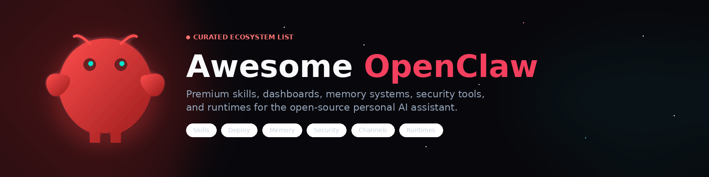

# 🦞 Awesome OpenClaw

<i>A premium curated list of high-quality resources for the <a href="https://github.com/openclaw/openclaw">OpenClaw</a> ecosystem.</i>

  
  
  
  

<b>If this list saves you time, consider giving the repo a star.</b>

<a href="./CONTRIBUTING.md">Contributing Guide</a> · <a href="./LICENSE">License</a>

---

## 📋 Contents

- [🏛️ Official Resources](#official-resources)
- [🧰 Skills & Registries](#skills-registries)
- [🎛️ Dashboards & Control Centers](#dashboards-control-centers)
- [🚀 Deployment & Operations](#deployment-operations)
- [🧠 Memory & Context Systems](#memory-context-systems)
- [🛡️ Security & Safety](#security-safety)
- [🔌 Plugins & Channel Integrations](#plugins-channel-integrations)
- [⚡ Alternative Clients & Runtimes](#alternative-clients-runtimes)
- [🎓 Learning Resources](#learning-resources)

## 🏛️ Official Resources

- [openclaw/openclaw](https://github.com/openclaw/openclaw)  - The core OpenClaw project.
- [openclaw.ai](https://openclaw.ai) - Official website.
- [docs.openclaw.ai](https://docs.openclaw.ai) - Official documentation.
- [openclaw/lobster](https://github.com/openclaw/lobster)  - Official workflow shell for composing tools and resumable automations.
- [openclaw/openclaw-windows-node](https://github.com/openclaw/openclaw-windows-node)  - Official Windows companion suite.
- [openclaw/acpx](https://github.com/openclaw/acpx)  - Official headless CLI client for stateful ACP sessions.
- [openclaw/Peekaboo](https://github.com/openclaw/Peekaboo)  - Official macOS screenshot CLI and optional MCP server with visual question answering for agents.
- [openclaw/mcporter](https://github.com/openclaw/mcporter)  - Official TypeScript API and CLI for calling MCP servers as plain functions.
- [openclaw/wacli](https://github.com/openclaw/wacli)  - Official WhatsApp CLI for sync, search, and send from agent workflows.
- [openclaw/imsg](https://github.com/openclaw/imsg)  - Official Apple Messages.app CLI so agents can send and receive iMessage/SMS.
- [openclaw/crabbox](https://github.com/openclaw/crabbox)  - Official sandbox helper: warm a box, sync the diff, run the suite.
- [openclaw/clawsweeper](https://github.com/openclaw/clawsweeper)  - Official issue and PR triage bot that suggests what can close and why.
- [openclaw/AXorcist](https://github.com/openclaw/AXorcist)  - Official Swift macOS Accessibility wrapper for agent UI automation.
- [openclaw/discrawl](https://github.com/openclaw/discrawl)  - Official Discord CLI with sqlite backend for agent channel access.
- [openclaw/slacrawl](https://github.com/openclaw/slacrawl)  - Official Slack CLI with sqlite backend for agent channel access.
- [openclaw/clickclack](https://github.com/openclaw/clickclack)  - Official chat app built for claws.
- [openclaw/crabfleet](https://github.com/openclaw/crabfleet)  - Official mission control for agent runs.

<a href="#contents">⬆️ Back to Top</a>

## 🧰 Skills & Registries

- [openclaw/clawhub](https://github.com/openclaw/clawhub)  - Official skill directory and discovery hub.
- [openclaw/agent-skills](https://github.com/openclaw/agent-skills)  - Official useful skills pack for agents and claws.
- [VoltAgent/awesome-openclaw-skills](https://github.com/VoltAgent/awesome-openclaw-skills)  - Large external skills index of 5,400+ ClawHub skills by category.
- [LeoYeAI/openclaw-master-skills](https://github.com/LeoYeAI/openclaw-master-skills)  - Curated collection of 1,200+ best OpenClaw skills — weekly updated.
- [iflytek/skillhub](https://github.com/iflytek/skillhub)  - Self-hosted enterprise agent skill registry with versioning, RBAC, audit logs, and Docker/Kubernetes deploy.
- [FreedomIntelligence/OpenClaw-Medical-Skills](https://github.com/FreedomIntelligence/OpenClaw-Medical-Skills)  - Large domain-specific medical skills library for OpenClaw.
- [ClawBio/ClawBio](https://github.com/ClawBio/ClawBio)  - Bioinformatics-native OpenClaw skill library.
- [refly-ai/refly](https://github.com/refly-ai/refly)  - Open-source agent skills builder for creating reusable workflows and bots.
- [unbrowse-ai/unbrowse](https://github.com/unbrowse-ai/unbrowse)  - API-native browser skill and CLI for agent workflows.
- [libukai/awesome-agent-skills](https://github.com/libukai/awesome-agent-skills)  - Broader agent-skills guide with OpenClaw overlap.
- [kepano/obsidian-skills](https://github.com/kepano/obsidian-skills)  - Agent skills for Obsidian. Teach your agent to use Markdown, Bases, JSON Canvas, and the CLI.
- [mvanhorn/last30days-skill](https://github.com/mvanhorn/last30days-skill)  - AI agent skill that researches any topic across Reddit, X, YouTube, HN, Polymarket, and the web.
- [kesslerio/coding-agent-openclaw-skill](https://github.com/kesslerio/coding-agent-openclaw-skill)  - Coding agent skill that orchestrates Codex, Claude Code, Gemini, Pi, and OpenCode CLIs.
- [agentskillexchange/skills](https://github.com/agentskillexchange/skills)  - Open catalog of 2,000+ security-scanned AI agent skills for Claude Code, Cursor, Codex, and OpenClaw.
- [drakulavich/kesha-voice-kit](https://github.com/drakulavich/kesha-voice-kit)  - Open-source voice toolkit with OpenClaw skill. Speech-to-text (25 langs), text-to-speech (Kokoro + Piper), voice-activity detection.
- [cookiy-ai/user-research-skill](https://github.com/cookiy-ai/user-research-skill)  - End-to-end user research skill for AI agents — AI interviews, synthetic users, quant surveys.
- [JuneYaooo/gpt-image2-ppt-skills](https://github.com/JuneYaooo/gpt-image2-ppt-skills)  - Clone any .pptx into your own deck using GPT-image-2. Claude Code / OpenClaw skill.
- [jsrgjcy/powershell-windows-skill](https://github.com/jsrgjcy/powershell-windows-skill)  - OpenClaw skill for Windows PowerShell operations — script generation, execution conventions, safety checks.
- [JunjieYu95/glancely](https://github.com/JunjieYu95/glancely)  - All-in-one personal tracker skill bundle — diary, mood, reminders, daily MIT with read-only dashboard.
- [HITsz-TMG/VideoClaw](https://github.com/HITsz-TMG/VideoClaw)  - AI video generation coworker — chat an idea and produce a film-style output for OpenClaw-style agents.
- [screenpipe/screenpipe](https://github.com/screenpipe/screenpipe)  - Local 24/7 screen recording that plugs into OpenClaw, Hermes, and other agents (YC S26).

<a href="#contents">⬆️ Back to Top</a>

## 🎛️ Dashboards & Control Centers

- [ValueCell-ai/ClawX](https://github.com/ValueCell-ai/ClawX)  - Desktop GUI for running and managing OpenClaw agents without living in the terminal.
- [clawdeckio/clawdeck](https://github.com/clawdeckio/clawdeck)  - Mission-control dashboard for OpenClaw agents.
- [mudrii/openclaw-dashboard](https://github.com/mudrii/openclaw-dashboard)  - Command-center style dashboard focused on visibility and management.
- [tugcantopaloglu/openclaw-dashboard](https://github.com/tugcantopaloglu/openclaw-dashboard)  - Secure real-time monitoring dashboard with auth, cost tracking, and memory browsing.
- [builderz-labs/mission-control](https://github.com/builderz-labs/mission-control)  - Open-source orchestration dashboard for agent fleets and task dispatch.
- [abhi1693/openclaw-mission-control](https://github.com/abhi1693/openclaw-mission-control)  - Dashboard for coordinating multi-agent work via OpenClaw Gateway.
- [grp06/openclaw-studio](https://github.com/grp06/openclaw-studio)  - Polished web dashboard for connecting gateways, managing agents, and operating faster.
- [jontsai/openclaw-command-center](https://github.com/jontsai/openclaw-command-center)  - AI assistant command and control dashboard.
- [daggerhashimoto/openclaw-nerve](https://github.com/daggerhashimoto/openclaw-nerve)  - Real-time cockpit with voice, kanban, workspace control, and usage visibility.
- [xmanrui/OpenClaw-bot-review](https://github.com/xmanrui/OpenClaw-bot-review)  - Lightweight dashboard for viewing bots, agents, models, and sessions at a glance.
- [TianyiDataScience/openclaw-control-center](https://github.com/TianyiDataScience/openclaw-control-center)  - Local control center focused on visibility and operator trust.
- [vivekchand/clawmetry](https://github.com/vivekchand/clawmetry)  - Open source observability for OpenClaw: token costs, session drift, memory alerts. `pip install clawmetry`. Nothing leaves your machine.
- [dreamwing/clawbridge](https://github.com/dreamwing/clawbridge)  - Mobile dashboard for monitoring sessions, costs, and tasks.
- [lay2dev/clawpal](https://github.com/lay2dev/clawpal)  - Visual manager for agents, models, and config.
- [Curbob/LobsterBoard](https://github.com/Curbob/LobsterBoard)  - Self-hosted drag-and-drop dashboard builder with 60+ widgets and template gallery.
- [qingchencloud/clawpanel](https://github.com/qingchencloud/clawpanel)  - Cross-platform desktop management panel with built-in assistant features.
- [robsannaa/openclaw-mission-control](https://github.com/robsannaa/openclaw-mission-control)  - GUI for managing OpenClaw without touching the CLI.
- [zhaoxinyi02/ClawPanel](https://github.com/zhaoxinyi02/ClawPanel)  - Go-based visual management panel with real-time logs.
- [luccast/crabwalk](https://github.com/luccast/crabwalk)  - Real-time companion monitor for OpenClaw agents.
- [getclawe/clawe](https://github.com/getclawe/clawe)  - Trello-style multi-agent coordination system built around OpenClaw workflows.
- [SweetSophia/openclaw-pixel-agents](https://github.com/SweetSophia/openclaw-pixel-agents)  - Pixel art office dashboard where AI agents walk around, sit at desks, and visually reflect their activity in real time.
- [comet-ml/opik-openclaw](https://github.com/comet-ml/opik-openclaw)  - Official plugin for OpenClaw that exports agent traces to Opik. Monitor agent behaviour, cost, tokens, errors.
- [farion1231/cc-switch](https://github.com/farion1231/cc-switch)  - Cross-platform desktop all-in-one assistant for Claude Code, Codex, OpenCode, OpenClaw, Gemini CLI, and Hermes Agent.
- [cft0808/edict](https://github.com/cft0808/edict)  - OpenClaw multi-agent orchestration system with specialized agents, real-time dashboard, model config, and audit trails.
- [gluk-w/claworc](https://github.com/gluk-w/claworc)  - User-friendly orchestrator for OpenClaw fleets and workflows.
- [junhoyeo/tokscale](https://github.com/junhoyeo/tokscale)  - CLI for tracking token usage across OpenClaw, Claude Code, Codex, OpenCode, Gemini, Cursor, and more.

<a href="#contents">⬆️ Back to Top</a>

## 🚀 Deployment & Operations

- [openclaw/openclaw-ansible](https://github.com/openclaw/openclaw-ansible)  - Official hardened installer for self-hosted deployments.
- [openclaw/nix-openclaw](https://github.com/openclaw/nix-openclaw)  - Official Nix packaging.
- [openclaw/homebrew-tap](https://github.com/openclaw/homebrew-tap)  - Official Homebrew distribution.
- [openclaw/clawdinators](https://github.com/openclaw/clawdinators)  - Declarative NixOS/AWS infrastructure for persistent agent deployments.
- [cloudflare/moltworker](https://github.com/cloudflare/moltworker)  - Run OpenClaw on Cloudflare Workers.
- [paperclipinc/openclaw-operator](https://github.com/paperclipinc/openclaw-operator)  - Kubernetes operator for deploying and managing OpenClaw agents with security, observability, and lifecycle controls.
- [joshavant/clawbox](https://github.com/joshavant/clawbox)  - OpenClaw-ready macOS virtual machines.
- [nikilster/clawflows](https://github.com/nikilster/clawflows)  - Prebuilt OpenClaw workflows and automation helpers.
- [1Panel-dev/1Panel](https://github.com/1Panel-dev/1Panel)  - Server panel with one-click OpenClaw deployment.
- [getumbrel/umbrel](https://github.com/getumbrel/umbrel)  - Home server OS with OpenClaw in the app store alongside storage, media, and other self-hosted apps.
- [serithemage/serverless-openclaw](https://github.com/serithemage/serverless-openclaw)  - Run OpenClaw on AWS serverless infrastructure with low idle cost.
- [mnfst/manifest](https://github.com/mnfst/manifest)  - Routing and observability layer for reducing OpenClaw model costs.
- [LeoYeAI/openclaw-guardian](https://github.com/LeoYeAI/openclaw-guardian)  - Watchdog and self-healing helper for OpenClaw Gateway operations.
- [dongsheng123132/u-claw](https://github.com/dongsheng123132/u-claw)  - Portable offline installer bundle and distribution path.
- [miaoxworld/OpenClawInstaller](https://github.com/miaoxworld/OpenClawInstaller)  - One-click installer for OpenClaw setups.
- [justlovemaki/openclaw-docker-cn-im](https://github.com/justlovemaki/openclaw-docker-cn-im)  - Docker distribution preconfigured for major Chinese IM integrations.
- [linuxhsj/openclaw-zero-token](https://github.com/linuxhsj/openclaw-zero-token)  - Run OpenClaw against major AI models without traditional API tokens.

<a href="#contents">⬆️ Back to Top</a>

## 🧠 Memory & Context Systems

- [Martian-Engineering/lossless-claw](https://github.com/Martian-Engineering/lossless-claw)  - Lossless context-management plugin for OpenClaw.
- [NevaMind-AI/memU](https://github.com/NevaMind-AI/memU)  - Long-term memory layer for proactive OpenClaw-style agents.
- [MemTensor/MemOS](https://github.com/MemTensor/MemOS)  - Memory OS for persistent skill memory and cross-task reuse.
- [CortexReach/memory-lancedb-pro](https://github.com/CortexReach/memory-lancedb-pro)  - Enhanced LanceDB-backed memory plugin with hybrid retrieval and reranking.
- [EverMind-AI/EverMemOS](https://github.com/EverMind-AI/EverMemOS)  - Memory OS focused on personalization and token savings.
- [supermemoryai/openclaw-supermemory](https://github.com/supermemoryai/openclaw-supermemory)  - Long-term memory extension for OpenClaw.
- [mem9-ai/mem9](https://github.com/mem9-ai/mem9)  - Unlimited memory layer for long-horizon OpenClaw workflows.
- [zilliztech/memsearch](https://github.com/zilliztech/memsearch)  - Markdown-first memory system inspired by OpenClaw.
- [volcengine/OpenViking](https://github.com/volcengine/OpenViking)  - Open-source context database designed specifically for AI Agents through a file system paradigm.
- [memorycrystal/memorycrystal](https://github.com/memorycrystal/memorycrystal)  - Persistent cognitive memory layer with vector-indexed knowledge graph. Ships as OpenClaw plugin and MCP server.
- [usecortex/openclaw-hydradb](https://github.com/usecortex/openclaw-hydradb)  - OpenClaw plugin for HydraDB providing agentic memory with automatic conversation capture and recall.
- [TencentCloud/TencentDB-Agent-Memory](https://github.com/TencentCloud/TencentDB-Agent-Memory)  - Fully local long-term agent memory via a four-tier progressive pipeline with zero external API dependencies.
- [garrytan/gbrain](https://github.com/garrytan/gbrain)  - Opinionated agent brain stack for OpenClaw and Hermes agents.
- [oceanbase/powermem](https://github.com/oceanbase/powermem)  - AI memory plugin focused on accuracy, agility, and cost for agent workloads.
- [MemTensor/MemOS-Cloud-OpenClaw-Plugin](https://github.com/MemTensor/MemOS-Cloud-OpenClaw-Plugin)  - Official MemOS Cloud plugin for OpenClaw — recall context before runs and save conversations after.

<a href="#contents">⬆️ Back to Top</a>

## 🛡️ Security & Safety

- [prompt-security/clawsec](https://github.com/prompt-security/clawsec)  - Security skill suite for audits, integrity checks, and drift detection.
- [Tencent/AI-Infra-Guard](https://github.com/Tencent/AI-Infra-Guard)  - Full-stack AI red-teaming platform with OpenClaw security scan, agent scan, skills scan, MCP scan, and jailbreak evaluation.
- [ucsandman/dashclaw](https://github.com/ucsandman/dashclaw)  - Decision infrastructure for AI agents with governance policies, human-in-the-loop approvals, risk scoring, replayable audit trails, and compliance controls.
- [nearai/ironclaw](https://github.com/nearai/ironclaw)  - Privacy- and security-focused Rust implementation inspired by OpenClaw.
- [NVIDIA/NemoClaw](https://github.com/NVIDIA/NemoClaw)  - More secure managed runtime approach for OpenClaw-style workloads.
- [tophant-ai/ClawVault](https://github.com/tophant-ai/ClawVault)  - Security vault project for tighter control around OpenClaw environments.
- [InnerWarden/innerwarden](https://github.com/InnerWarden/innerwarden)  - Security agent for Linux servers and AI agents — validates commands before execution, blocks dangerous ones, and captures attacker behavior.
- [peg/rampart](https://github.com/peg/rampart)  - Open-source firewall for AI agents. Policy engine that audits and controls what OpenClaw, Claude Code, Cursor, Codex, and any AI tool can do on your machine.
- [christinminor459/OnionClaw](https://github.com/christinminor459/OnionClaw)  - Provide AI agents with full Tor network access and dark web data through a zero-config OpenClaw skill or standalone tool.
- [getaxonflow/axonflow-openclaw-plugin](https://github.com/getaxonflow/axonflow-openclaw-plugin)  - AxonFlow governance for OpenClaw agents — block dangerous tools, govern MCP access, and keep audit trails.
- [secr-dev/openclaw-plugin](https://github.com/secr-dev/openclaw-plugin)  - Native secrets manager plugin for OpenClaw — brokers credentials, enforces per-agent allowlists, gates tool calls through MCP with approval queues.
- [backbay-labs/clawdstrike](https://github.com/backbay-labs/clawdstrike)  - AI EDR for developer workstations and autonomous agent fleets with swarm detection and response.

<a href="#contents">⬆️ Back to Top</a>

## 🔌 Plugins & Channel Integrations

- [BlockRunAI/ClawRouter](https://github.com/BlockRunAI/ClawRouter)  - LLM router for OpenClaw with model selection and cost-control focus.
- [soimy/openclaw-channel-dingtalk](https://github.com/soimy/openclaw-channel-dingtalk)  - DingTalk channel plugin for OpenClaw.
- [larksuite/openclaw-lark](https://github.com/larksuite/openclaw-lark)  - Official Feishu and Lark channel plugin.
- [AlexAnys/openclaw-feishu](https://github.com/AlexAnys/openclaw-feishu)  - Feishu integration guide and plugin path.
- [m1heng/clawdbot-feishu](https://github.com/m1heng/clawdbot-feishu)  - Feishu plugin integration for the OpenClaw ecosystem.
- [DingTalk-Real-AI/dingtalk-moltbot-connector](https://github.com/DingTalk-Real-AI/dingtalk-moltbot-connector)  - DingTalk connector plugin for OpenClaw Gateway.
- [tencent-connect/openclaw-qqbot](https://github.com/tencent-connect/openclaw-qqbot)  - QQ bot channel integration for the OpenClaw ecosystem.
- [dingxiang-me/OpenClaw-Wechat](https://github.com/dingxiang-me/OpenClaw-Wechat)  - WeChat and WeCom integration with visual configuration and streaming support.
- [BytePioneer-AI/openclaw-china](https://github.com/BytePioneer-AI/openclaw-china)  - China-focused plugin pack covering Feishu, DingTalk, QQ, WeChat, and related channels.
- [1186258278/OpenClawChineseTranslation](https://github.com/1186258278/OpenClawChineseTranslation)  - Chinese translation and localized setup resources.
- [onfabric/waclaw](https://github.com/onfabric/waclaw)  - Self-hosted WhatsApp router for fleets of claws.
- [omarshahine/HomeClaw](https://github.com/omarshahine/HomeClaw)  - HomeKit smart home control via MCP — lights, locks, thermostats, and scenes for OpenClaw.
- [omarshahine/restaurant-cli](https://github.com/omarshahine/restaurant-cli)  - Pluggable CLI for booking restaurant reservations — Resy, OpenTable, Tock, SevenRooms. Works as both OpenClaw plugin and Claude Code plugin.
- [win4r/openclaw-a2a-gateway](https://github.com/win4r/openclaw-a2a-gateway)  - OpenClaw plugin implementing the A2A (Agent-to-Agent) protocol for bidirectional agent communication.

<a href="#contents">⬆️ Back to Top</a>

## ⚡ Alternative Clients & Runtimes

- [iOfficeAI/AionUi](https://github.com/iOfficeAI/AionUi)  - Free local cowork app and OpenClaw-style UI spanning multiple coding-agent ecosystems.
- [zeroclaw-labs/zeroclaw](https://github.com/zeroclaw-labs/zeroclaw)  - Fast, small, fully autonomous AI personal assistant infrastructure — deploy anywhere, swap anything.
- [nanocoai/nanoclaw](https://github.com/nanocoai/nanoclaw)  - Lightweight containerized OpenClaw alternative with messaging integrations, memory, and scheduled jobs.
- [netease-youdao/LobsterAI](https://github.com/netease-youdao/LobsterAI)  - Desktop-grade AI agent built on OpenClaw for real work — docs, slides, research — with phone control via WeChat, Feishu, DingTalk, and Telegram.
- [aiming-lab/AutoResearchClaw](https://github.com/aiming-lab/AutoResearchClaw)  - Fully autonomous self-evolving research agent from idea to paper.
- [nextlevelbuilder/goclaw](https://github.com/nextlevelbuilder/goclaw)  - OpenClaw rebuilt in Go with multi-tenant isolation, layered security, and native concurrency.
- [dataelement/Clawith](https://github.com/dataelement/Clawith)  - Multi-agent company runtime for coordinating OpenClaw-style agent teams.
- [moltis-org/moltis](https://github.com/moltis-org/moltis)  - Rust-native OpenClaw-style assistant runtime with sandboxing and voice support.
- [memovai/mimiclaw](https://github.com/memovai/mimiclaw)  - Hardware-oriented runtime for ultra-low-cost OpenClaw-style deployments.
- [HKUDS/nanobot](https://github.com/HKUDS/nanobot)  - Ultra-lightweight OpenClaw-style alternative.
- [sipeed/picoclaw](https://github.com/sipeed/picoclaw)  - Tiny fast OpenClaw-style runtime designed for lightweight and highly deployable setups.
- [poco-ai/poco-agent](https://github.com/poco-ai/poco-agent)  - Web UI-first alternative to OpenClaw with sandboxed runtime.
- [AidanPark/openclaw-android](https://github.com/AidanPark/openclaw-android)  - Run OpenClaw on Android with minimal setup.
- [yuga-hashimoto/openclaw-assistant](https://github.com/yuga-hashimoto/openclaw-assistant)  - Android voice assistant app with wake word activation and system integration.
- [HKUDS/ClawTeam](https://github.com/HKUDS/ClawTeam)  - Agent swarm automation framework for one-command team execution.
- [win4r/ClawTeam-OpenClaw](https://github.com/win4r/ClawTeam-OpenClaw)  - ClawTeam fork adapted for OpenClaw as the default multi-agent swarm runtime.
- [remorses/kimaki](https://github.com/remorses/kimaki)  - OpenClaw-like workflow on top of Opencode with deep Discord integration.
- [mosaxiv/clawlet](https://github.com/mosaxiv/clawlet)  - Ultra-lightweight personal assistant with OpenClaw overlap.
- [zevorn/rt-claw](https://github.com/zevorn/rt-claw)  - Cheap runtime alternative in the wider OpenClaw family.
- [librefang/librefang](https://github.com/librefang/librefang)  - Open-source agent operating system written in Rust. Live demo available.
- [tinyhumansai/openhuman](https://github.com/tinyhumansai/openhuman)  - Cross-platform OpenClaw-style assistant with a Rust core and Tauri desktop app, multi-channel messaging, knowledge-graph memory, skills, and voice.

<a href="#contents">⬆️ Back to Top</a>

## 🎓 Learning Resources

- [alvinunreal/awesome-openclaw-tips](https://github.com/alvinunreal/awesome-openclaw-tips)  - Curated OpenClaw tips, setup advice, and practical usage guidance.
- [hesamsheikh/awesome-openclaw-usecases](https://github.com/hesamsheikh/awesome-openclaw-usecases)  - Real-world use cases and applied examples.
- [AlexAnys/awesome-openclaw-usecases-zh](https://github.com/AlexAnys/awesome-openclaw-usecases-zh)  - Chinese OpenClaw use-case collection covering office, content, ops, and knowledge-management scenarios.
- [datawhalechina/hello-claw](https://github.com/datawhalechina/hello-claw)  - Structured Chinese tutorial for getting started with OpenClaw.
- [xianyu110/awesome-openclaw-tutorial](https://github.com/xianyu110/awesome-openclaw-tutorial)  - Comprehensive Chinese tutorial covering setup, configuration, and practical usage.
- [KimYx0207/AI-Coding-Guide-Zh](https://github.com/KimYx0207/AI-Coding-Guide-Zh)  - Chinese guide covering Claude Code, OpenClaw, and Codex with tutorials and a quick-reference card.
- [shareAI-lab/claw0](https://github.com/shareAI-lab/claw0)  - Zero-to-one curriculum for building a claw-style AI agent from scratch.
- [mengjian-github/openclaw101](https://github.com/mengjian-github/openclaw101)  - Seven-day OpenClaw 101 guide and resource aggregation hub.
- [centminmod/explain-openclaw](https://github.com/centminmod/explain-openclaw)  - Multi-AI documentation covering architecture, security, and deployment.
- [shuolucs/Awesome-OpenClaw-Research](https://github.com/shuolucs/Awesome-OpenClaw-Research)  - Research-oriented collection of papers, analyses, and resources on the OpenClaw ecosystem.

<a href="#contents">⬆️ Back to Top</a>

---

## 📝 Notes

- This list intentionally avoids listing obvious duplicate lineage repos separately.
- If a project fits multiple categories, it is listed once in its strongest category.
- If you want to improve this list, prefer adding projects with clear OpenClaw relevance, a latest meaningful commit within 30 days, and concise factual descriptions.

<a href="#contents">⬆️ Back to Top</a>

## ⭐ Star History

